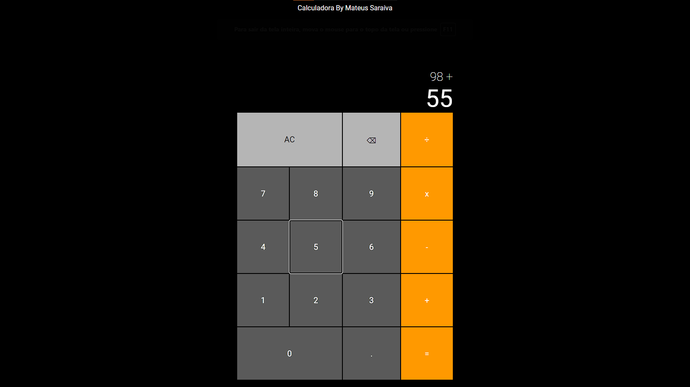
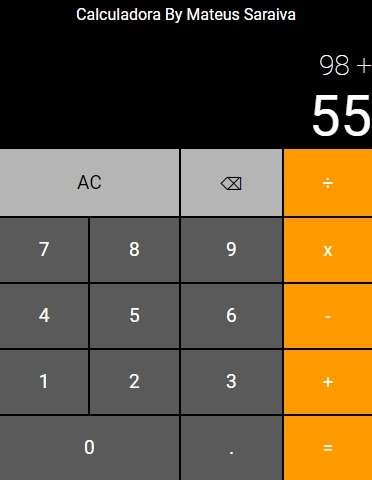

# CurrencyConverter

<a href="https://yolmat.github.io/Calculator/">  :smiley: Teste voce mesmo || Test it yourself</a>

<h2>Desktop</h2>

<h2>Mobile</h2>

Para ver o Design <a href="https://www.figma.com/file/QAhHa4QsEegzjzc8l6qnrR/Calculator?node-id=0%3A1&t=cBg3zLOifX0v8AWq-1" target="_blank"> Aperte Aqui </a>

Acompanhe a mapa mental desse projeto <a href="https://futuristic-stop-7c4.notion.site/Calculadora-42208ba5ec3c421bbb65776a9516c9cb" targt='_blank'> Apertando Aqui </a>

<h2>Motivo do projeto</h2>

Continuar a evolução das minhas habilidades em HTML CSS e JavaScript

Avançar na criação de codigos e logica de programação

Reponsividade na pratica, projeto feito com base no First-mobile

<h2>Trajetoria do projeto</h2>

O projeto ainda está em desenvolvimento e as próximas atualizações serão voltadas nas seguintes tarefas:

- [x] Concepção da ideia
- [x] Criação do Designer no Figma
- [X] Criação do HTML e CSS
- [X] Criação do Javascript
- [X] Ligação do Back-end com o Front-end do projeto
- [X] Projeto sendo colocado no ar
- [X] Reponsividade com computadores e notebooks

## 🤝 Colaboradores

Agradecemos às seguintes pessoas que contribuíram para este projeto:

<table>
  <tr>
    <td align="center">
      <a href="www.github.com/yolmat">
         
        
          <b>Yolmat</b>
        
      </a>
    </td>
  </tr>
</table>

[⬆ Voltar ao topo](#nome-do-projeto) 
